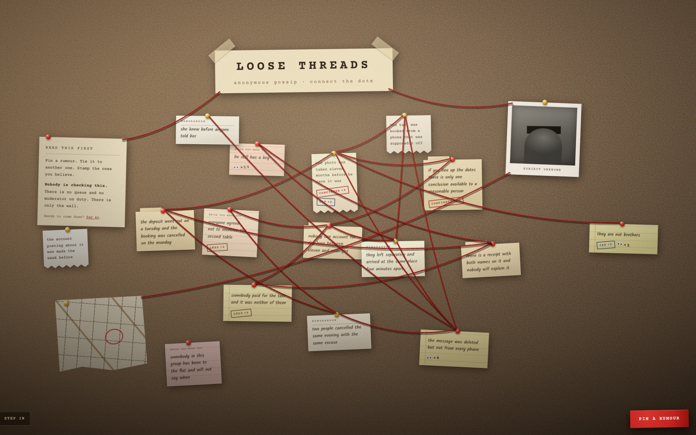

```
 ██╗      ██████╗  ██████╗ ███████╗███████╗
 ██║     ██╔═══██╗██╔═══██╗██╔════╝██╔════╝
 ██║     ██║   ██║██║   ██║███████╗█████╗
 ██║     ██║   ██║██║   ██║╚════██║██╔══╝
 ███████╗╚██████╔╝╚██████╔╝███████║███████╗
 ╚══════╝ ╚═════╝  ╚═════╝ ╚══════╝╚══════╝
 ████████╗██╗  ██╗██████╗ ███████╗ █████╗ ██████╗ ███████╗
 ╚══██╔══╝██║  ██║██╔══██╗██╔════╝██╔══██╗██╔══██╗██╔════╝
    ██║   ███████║██████╔╝█████╗  ███████║██║  ██║███████╗
    ██║   ██╔══██║██╔══██╗██╔══╝  ██╔══██║██║  ██║╚════██║
    ██║   ██║  ██║██║  ██║███████╗██║  ██║██████╔╝███████║
    ╚═╝   ╚═╝  ╚═╝╚═╝  ╚═╝╚══════╝╚═╝  ╚═╝╚═════╝ ╚══════╝
```

<div align="center">

### `PIN THE GOSSIP // CONNECT THE DOTS // TRUST NOBODY`

*an infinite corkboard for anonymous rumors, with red string and nobody on duty*

   -000000?style=flat-square&labelColor=111111) -000000?style=flat-square&labelColor=111111) 



<sub>the seeded demo board · `npm run seed` rebuilds it exactly</sub>

</div>

---

## 🧵 What is this

Loose Threads is one corkboard where anyone, anonymously, pins a gossip note and ties it to another note with red string — the conspiracy wall you've seen in every detective movie, except the suspects are celebrities, your local scene, and whoever someone decided to implicate at 2am.

Everything a stranger posts goes live the moment they post it. There is no queue and no approval step. The board had one once, and an empty board is what it got: you post a rumour, nothing appears, you close the tab. Moderation now happens *after* the fact, from `/admin`, where anything on the board can be edited in place or taken down.

You can't tidy it for everyone else. The wall is canonical and you are a guest: pan it, step back from it, read it, add to it. What you posted from this browser stays yours to take down, reword, untie or unstamp, and you can drag any note somewhere else in your own view without anybody else's wall moving.

```console
nick@loosethreads:~$ npm run dev
[✓] canvas mounted · 0 notes · 0 strings
[i] nobody is checking this. that is the feature.
```

## 🧷 The board

| | feature | what it actually does |
|---|---|---|
| 01 | **one corkboard, no node editor** | React Flow sits under the wall for its panning and zooming and nothing else: no dot grid, no controls, no minimap, no visible handles. Notes are its nodes at their stored coordinates, string is a custom edge, cork is feTurbulence noise |
| 02 | **five paper stocks** | legal pad, manila card, memo, message slip, torn receipt: different widths, different edges, different printing, picked from the note id so the wall looks hand-assembled |
| 03 | **red string** | tap a note, **Tie string**, tap the second one. It sags with the span, casts a shadow on the cork, crosses over the paper and stops short of the pins |
| 04 | **one wall that grows** | no sections and nothing to pick before posting. The wall is an ellipse whose radius grows as √n, so it is equally dense at five notes and at three hundred; a new note takes whichever of 20 candidate spots sits furthest from its neighbours and clear of the furniture |
| 05 | **instant publish** | no queue, no approval. Your note travels from the sheet you wrote it on to its place on the wall, and the board polls every 15s so your friends' notes land while you watch |
| 06 | **takedown, not review** | `/admin` shows what is live and can edit it in place or remove it. Removal is soft and takes its strings with it |
| 07 | **reaction stamps** | `CONFIRMED` · `CAP` · `👀` · `LMAO`, stamped as ink on the paper rather than buttons on a card. One per note per browser |
| 08 | **notes age** | paper yellows the longer it's been up. The ink ramps *darker* as it goes, so the oldest note on the board still clears 4.5:1 |
| 09 | **yours to manage** | every row you create hands your browser a secret. Take your own note down, reword it, untie your string, take a stamp back, all without an account. Clear your browser data and it's gone |
| 10 | **rearrange your own view** | drag a note (hold to lift, on touch) and it moves for you only, in sessionStorage. The string follows it. Nobody else's wall changes and a closed tab straightens yours back out |
| 11 | **no accounts** | no login, no profile, no email. A per-IP rate limit, counted in Postgres, is the whole gate |

## 🚀 Run it

You need a `DATABASE_URL` and an `ADMIN_SECRET`.

For local work there is no cloud database to sign up for: set
`DATABASE_URL=pglite:.pgdata` and the app runs Postgres itself, compiled to
WASM, in the dev server, with its data in a gitignored `.pgdata/` folder. Same
SQL, nothing to install, nothing left running. `rm -rf .pgdata` empties the
board. It refuses to start in production, where a database on the serverless
filesystem would quietly lose everything on it.

That is the whole configuration. The per-IP rate limit counts rows in the same
Postgres the notes live in, so there is no second service to sign up for, no
extra environment variables, and no way to deploy with the limit switched off:
if the database is reachable it is enforced, and if it is not, nothing works
anyway. There is no bot check. Nothing is reviewed before it publishes either,
so that limit and the takedown console are the entire defence.

```bash
git clone https://github.com/nitrimandylis/loosethreads.git
cd loosethreads
cp .env.example .env.local   # DATABASE_URL=pglite:.pgdata + any ADMIN_SECRET
npm install
npm run seed                 # optional: the board in the screenshot above
npm run dev
```

The database schema creates itself on first query, no migration step and no ceremony. Visit `/` for the board and `/admin` to judge humanity after the fact. `/?demo=1` puts a fixed board up with no database at all, for design work.

`npm run seed` wipes `.pgdata` and rebuilds the sixteen-note board at the top of
this README: one night reconstructed by people who were not all in the room,
twenty strings, and the stamps the argument collected. Positions come from the
real placer off a fixed seed and ages are relative to when you run it, so the
same wall comes back every time and stays re-shootable when the design moves.
Everything it writes is ordinary board data, so you can drag it, tie it, stamp
it and take it down like anything else. Stop the dev server first: two Postgres
VMs over one folder is one too many.

## 🔩 Under the hood

```mermaid
flowchart LR
    A[anonymous visitor] -->|note or red string| B[per-IP rate limit]
    B -->|bucket empty| X[429 · slow down]
    B --> C[(status=approved)]
    C --> H[public wall]
    H -.->|the browser that made it, with its secret| M[/api/manage]
    M --> C
    H -.->|you, later| F[/admin]
    F -->|edit in place| C
    F -->|remove| R[(status=removed)]
```

| layer/file | path | job |
|---|---|---|
| board | `src/app/board.tsx` | the wall: the React Flow viewport, step back, framing, tying, untying, dragging, polling |
| note | `src/app/note.tsx` | one pinned sheet as a React Flow node, its stamps as ink, and the tray you get when you pick it up |
| string | `src/app/yarn.tsx` | the red string as a custom edge: shadow, body, lit edge, sag and all |
| furniture | `src/app/furniture.tsx` | the wordmark, rules card, redacted photo and torn map, as nodes that never move |
| compose | `src/app/compose.tsx` | the blank sheet you write the rumour on |
| wall geometry | `src/lib/wall.ts` | bounds, landing scale, pin points, string paths. Pure functions, no DOM |
| paper | `src/lib/paper.ts` | which stock, tilt, pin and width a note gets, derived from its id |
| aging | `src/lib/aging.ts` | note age → visual bucket |
| submit api | `src/app/api/submit/route.ts` | the gate: rate-limits per action, then publishes immediately |
| manage api | `src/app/api/manage/route.ts` | acting on your own rows: take down, reword, untie, unstamp. The secret is the whole proof |
| your rows | `src/lib/mine.ts`, `src/lib/manage.ts` | the secrets this browser holds (localStorage), and the SQL that checks one inside the `WHERE` |
| your view | `src/lib/moved.ts` | where you dragged notes to, in sessionStorage. Never sent anywhere |
| rate limits | `src/lib/ratelimit.ts` | five buckets priced by cost, counted in Postgres: notes 5, strings 15, stamps 60, manage 30 per 10 min, logins 5 per 15 min, per IP |
| admin | `src/app/admin/` | secret-gated live board: edit in place, remove, sign out |
| db | `src/lib/db.ts` | lazy Neon client + self-creating schema (`nodes`, `edges`, `reactions`) |
| queries | `src/lib/queries.ts` | public board read + the moderator's live-board read |
| placement | `src/lib/placement.ts` | where a new note lands: a wall that grows as √n, keeping clear of what is already up |
| demo board | `src/lib/demo.ts` | `/?demo=1` in development: a fixed board with no database, for design work and for re-shooting the link preview |
| seeded board | `scripts/seed.ts` | `npm run seed`: the sixteen-note story at the top of this README, written into `.pgdata` as ordinary board data |
| design system | `src/app/globals.css` | the whole visual system, documented in the header comment |

Design intent lives in [`PRODUCT.md`](PRODUCT.md); the palette, paper stocks and type
pairing are documented at the top of `globals.css`. Read both before restyling anything.

**Stack:** Next.js 16 · React 19 · React Flow · anime.js · Neon Postgres · TypeScript

---

<div align="center">

**[Nick Trimandylis](https://github.com/nitrimandylis)**

`THE STRING CONNECTS EVERYTHING // NOBODY IS CHECKING THIS`

</div>
